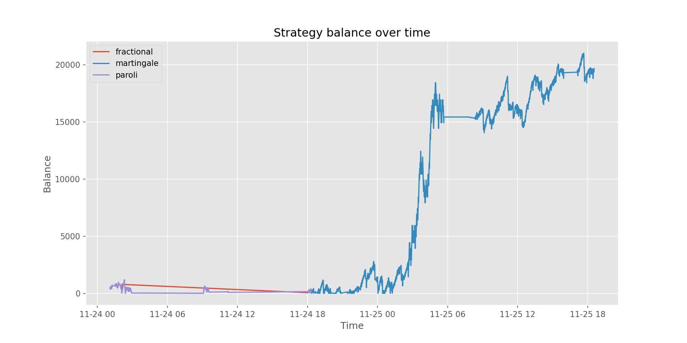

# CSGOFast bot
This is a pyton3 + playwright bot to farm the CSGOFast free coins / tickets.
The game conditions are:
- Every time the balance is 0, you can claim 100 free coins;
- HiLo max bet is 500 coins;
- you've a 47.5% chance to double per bet;
- 1.000.000 coins is 1$

With that said, even with a strategy, the odds are incredibly against you. Here's the plot of my balance over a few days (mostly using the Martingale strategy with 1.6x multiplier and 47.68 base bet):



## Instalation
- Install Playwright:
```powershell
pip3 install playwright
playwright install
```

## Running
The hilo bot can be ran with:
```powershell
python farm_hilo.py
```
This will spawn a chromimum browser window that the bot controls.

- First time use: log in to csgofast and, afterwards, open the Free Coins tab. 
- Later uses: the browser will reuse `my_profile` so you just need to click the Free Coins tab to start.

- What the bot does:
  1. Clicks Free Coins to claim the 100 free coins (even if you still have a positive balance).
  2. Opens the HiLo game and bets on red repeatedly while balance > 0.
  3. When balance reaches 0 it will try to claim free coins again and continue.

- Strategies (in `strategies/`):
  - Martingale — double after a loss, reset on win.
  - Paroli — increase after wins up to a target streak, then reset.
  - Fractional (Kelly-style) — bet a fraction of your balance that depends on
    your current bankroll. This repo's `FractionalStrategy` follows the user's
    specification:
      * Small balances (< 500): bet 100% (all-in).
      * Medium balances (500–5000): bet between ~75% (at the low end) and ~50%
        (at the high end) — the implementation linearly interpolates the
        fraction across this band.
      * High balances (>= 5000): use a smaller fraction (default ~25%) to
        reduce variance.
    The file is `strategies/fractional.py` and exposes `FractionalStrategy`.

Note: see `.env` for example parameters for each strategy.